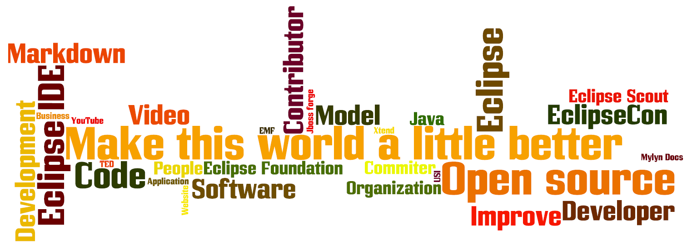

= Let be part of it
Jeremie Bresson
2014-11-01
:jbake-type: post
:jbake-status: published
:jbake-tags: blog, eclipse
:idprefix:

I really appreciate to read blogs from all over the world...
I think this is an incredible way to learn from others and to share knowledge.

I have opened this blog to be part of it.
I see it as a way to share knowledge and to write about my ideas. 

I have hosted this blog on link:https://github.com/jmini/jmini.github.io[GitHub]. 
Maybe someone will send me some link:https://github.com/jmini/jmini.github.io/pulls[pull requests] to improve the content (update broken links, fix typo, rephrase the text).
Feel free to use the link:https://github.com/jmini/jmini.github.io/issues[issue tracker] to suggest new topic or to start a discussion.

