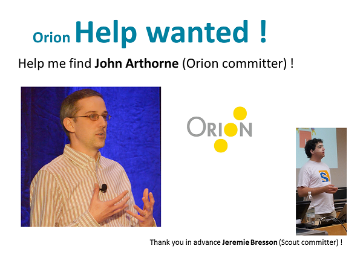
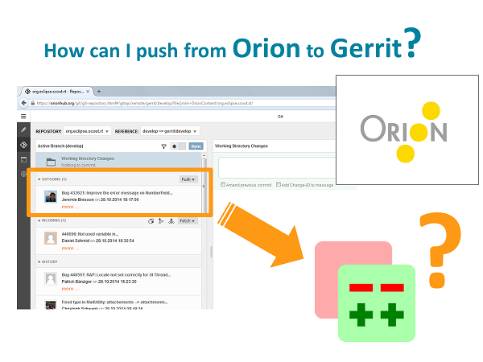
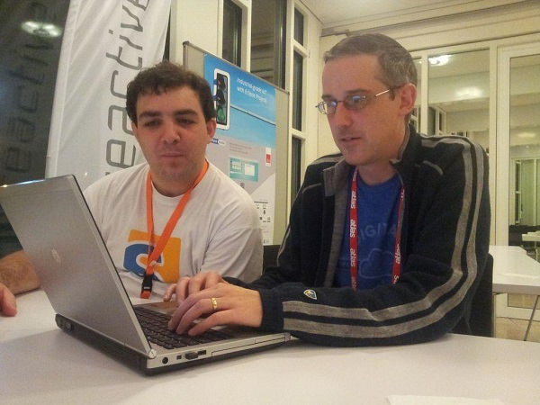

= EclipseCon participation and return on investment
Jeremie Bresson
2014-11-10
:jbake-type: post
:jbake-status: published
:jbake-tags: eclipse, eclipsecon
:idprefix:

2 weeks ago, I had the chance to participate to the link:http://www.eclipsecon.org/europe2014/[EclipseCon Europe 2014] and enjoyed it.
On the way back, I was asking myself why I found it so great.

Of course, like in every conference, you have a lot of talks proposed on parallel tracks.
You can pick the topics that are interesting for you and make your own program.
Talks are a good way to discover a new trend, a new feature, a new tool…

The keynotes are also great.
For me it is always a great source of inspiration.
They are a way to discover new ideas or new approach.
Sometime there is nothing new in the talk but the presentation and or the speaker make the difference.
A keynote is good if I can think of the message days or months later.

I have tried to check is the investment (time, money - for you and / or your company) was justified or not.
In my opinion it is all about what you have learned during those days.
New tools or trends are important, but solving the real problems you have in your project is what will make a difference.

== My experiment

This summer I have started to evaluate the link:http://www.eclipse.org/orion/[web-IDE Orion] to contribute something in the link:http://www.eclipse.org/scout/[Eclipse Scout] git link:http://git.eclipse.org/c/scout/org.eclipse.scout.rt.git/[repository] using link:http://git.eclipse.org/r/[gerrit].
I wasn't very successful (see this forum thread: link:http://www.eclipse.org/forums/index.php/mv/msg/790507/1396617/#msg_1396617[push a commit to gerrit]).
I decided to stop the experiment and not to invest much time in the evaluation.
I never worked on this task again.

On Wednesday, when I was at the EclipseCon, it hit me: one or more attendants of the EclipseCon had probably the information I needed in order to push my commit to Gerrit.
I started to ask around (IBM booth, staff of the eclipse foundation) and everybody told me I should speak to John Arthorne.
I needed to find him and I started to ask around.
To maximize my chances, I started to misuse the monitor at the eclipse scout booth during the evening (Club ECE).

We also used link:http://twitter.com/EclipseScout/status/527546521144000513[Twitter] to broadcast the information.

Suddenly link:https://twitter.com/OPCoach_Eclipse[Olivier Prouvost] told me: "Hey, John is right here".
This is the EclipseCon magic!

John helped me with my problems and we managed to push my commit from Orion to Gerrit.

.Published on link:http://twitter.com/EclipseScout/status/527556988486828032[twitter]. Photo credit: Matthias Zimmermann

== Helping others

I think this mechanic is important and can justify for people to come to the EclipseCon.
At the Eclipse Scout booth, we always welcome people coming with a laptop and their questions about our framework.
We always manage to find the time to do some pair-programming at our booth. It is a kind of "1:1 training" for free.

If you plan to attend to an EclipseCon, you should prepare a list of questions or of problems you want to solve during the conference.
Finding people is not complicated: attend to a talk on the topic, identify the speaker and talk to him later.
Visit a booth.
Start to ask around.
Everybody will be happy to help you.
You will discover what being part of the Eclipse community means.

