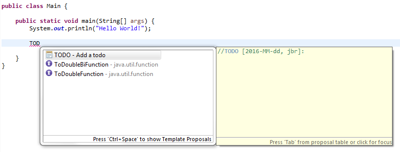
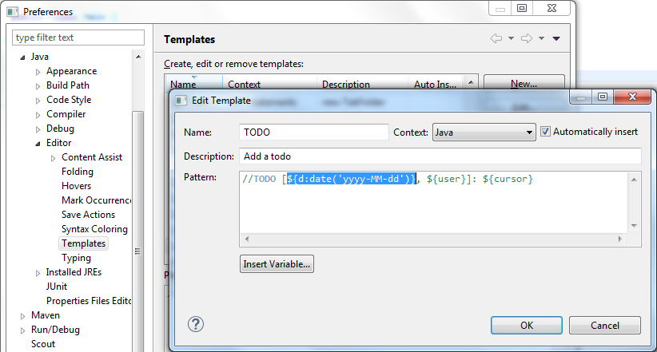
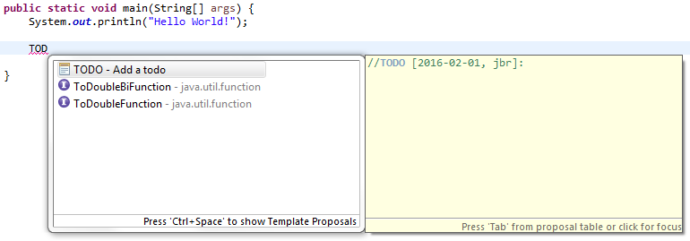

= Bug 75981 is fixed!
Jeremie Bresson
2016-02-06
:jbake-type: post
:jbake-status: published
:jbake-tags: eclipse, open-source
:idprefix:

Like many of my Eclipse stories, it starts during a coffee break.

* Have you seen the new TODO template I have configured for our project?
* Yes. It is nice...

* But I hate having to set the date manually.
* I know but it is not possible with Eclipse.
* ...

A quick search on Google pointed me to link:https://bugs.eclipse.org/bugs/show_bug.cgi?id=75981[Bug 75981].
I was not the only one looking for a solution to this issue:

* http://stackoverflow.com/q/1131712[How to set the Eclipse date variable format?]
* http://stackoverflow.com/q/32119571[Templates in Eclipse]
* https://twitter.com/Grummfy/status/12874338803[Tweet by @Grummfy]
* https://twitter.com/Sigasi/status/381436597579038720[Tweet by @Sigasi]

By analyzing the Bugzilla history I have noticed that already 2 contributors have started to work on this (a long time ago) and the feedback to the latest patch never got any answers.
I reworked the last proposal...
and...

I am happy tell you that you can now do the following:

Short description of the possibilities:

* As before you can use the date variable with no argument. Example: `${date}`
* You can use the variable with additional arguments. In this case you will need to name the variable (since you are not reusing the date somewhere else, the name of the variable doesn't matter). Example: `${mydate:date}`
** The first parameter is the date format. Example: `${d:date('yyyy-MM-dd')}`
** The second parameter is the locale. Example: `${maDate:date('EEEE dd MMMM yyyy HH:mm:ss Z', 'fr')}`

Back to our use case, it now works as expected:

Do not hesitate to try the feature and to report any issue you can find.
The fix is implemented with the M5 milestone release of Eclipse Neon.
You can download this version now here:

http://www.eclipse.org/downloads/index-developer.php

This experiment was also a great opportunity for me to measure how the development process at Eclipse has been improved:

* With Eclipse Oomph (a.k.a Eclipse Installer) it is possible setup the Workspace to work on "Platform Text" very quickly
* With Gerrit it is much easier for me (a simple contributor) to work with the commiters of the project (propose a patch, discuss each line, push a new version, rebase on top of HEAD...)
* With the Maven Build, the build is reproducible (I never tried to build the platform with the old PDE Build, but I believe that this was not possible for somebody like me)

Where I spend most of the time:

* Analysis of the proposed patches and existing feedbacks in Bugzilla
* Figure out how I could add some unit tests (for the existing behaviour and for the new use cases).

This was a great experience for me and I am really happy to have contributed this fix.
