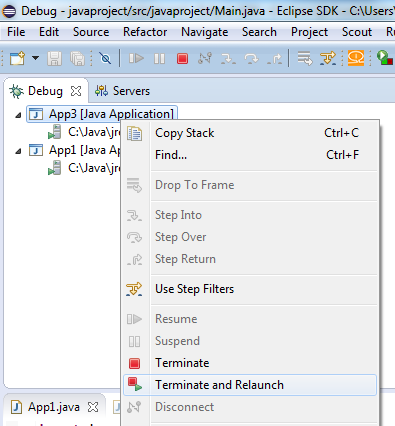
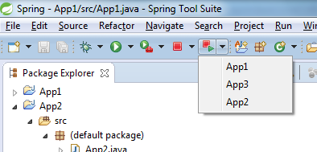

= Terminate and Relaunch in Eclipse IDE
Jeremie Bresson
2016-02-12
:jbake-type: post
:jbake-status: published
:jbake-tags: eclipse, open-source
:idprefix:

Are you using the "Terminate and Relaunch" context menu in the Debug view?

Last year link:https://twitter.com/martinlippert[Martin Lippert] did a demo of the "Spring Tool Suite" at the Eclipse Demo Camp in Zurich.
He presented a great addition to the Eclipse Toolbar: the possibility to terminate and relaunch an application from anywhere.

We discussed after his presentation if this feature could be integrated in Eclipse IDE.
I think it would be great and I imagine I would use it every day (now I am switching to the Debug perspective to do it).
I have opened link:https://bugs.eclipse.org/bugs/show_bug.cgi?id=487554[Bug 487554] for that. Feel free to share your opinion there.

