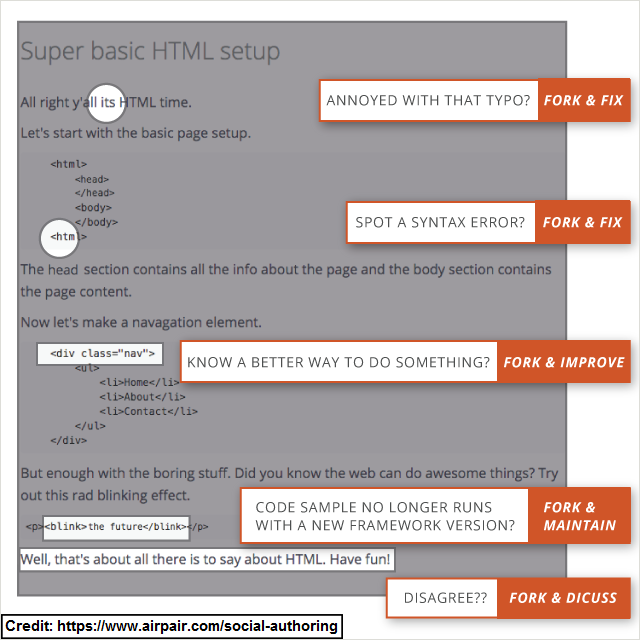

= Use pull requests to improve documentation
Jeremie Bresson
2016-03-02
:jbake-type: post
:jbake-status: published
:jbake-tags: asciidoctor, open-source
:idprefix:
:listing-caption: Listing

Last November, I have presented a short introduction on Asciidoctor: 
_Writing documentation with Asciidoctor_ (link:https://www.eclipsecon.org/europe2015/sites/default/files/slides/2015-11-03_Writing_documentation_with_Asciidoctor.pdf[slides], link:https://www.youtube.com/watch?v=MyhiD65qaUI[video]).
As you can see in the video, several projects hosted by the Eclipse Fundation are already using Asciidoctor.

At the end of the presentation I discuss the fact, that you should always indicate to your readers how they can improve the document.
In the latest version of the Eclipse Scout documentation (for example the link:http://eclipsescout.github.io/5.2/latest/article_helloworld/scout_helloworld/scout_helloworld.html[Hello World Tutorial]), I have included a link "edit on GitHub" at the bottom of each document:

image:2016-03-02_edit_on_gh_link.png[]

Because I believe in this approach, even this blog has a "see source on GitHub" link at the bottom of each article.

The Pull Request model (it is the same for Gerrit changes) is really powerful tool to improve documentation.
Each user can propose changes to the document, in order to improve it for all other readers.
This is the exact same mechanism that makes Wikipedia the best encyclopedia of the world.
Dan Allen has proposed a great slide to illustrate this idea:

In the Eclipse Scout project, we have decided to use GitHub for our documentation, because they provide a really great interface to edit AsciiDoc text directly online. 
Even without having to check out the document, users can edit the text and get some preview of their changes.
With one or two additional clicks they submit a pull request.
With this kind of tools, the complexity of having a Git repository is removed.
Users get something similar as online wiki engines, with one important addition:
each change can be reviewed and discussed before it gets integrated into the final document.

By the way for closed source code, we are using a GitLab Backend on our company servers. 
We get a very similar user experience as with GitHub (see: link:https://about.gitlab.com/2016/02/10/feature-highlight-create-files-and-directories-from-files-page/[Create files and directories from the Files page]).
The AsciiDoc editor is also great there.

A propos Asciidoctor, I will hold a Quickie Talk tomorrow (Thursday 03.03.2016) at Voxxed Day Zurich: link:https://cfp-vdz.exteso.com/program/talk/WNL-9236/Writing_documentation_with_Asciidoctor.html[Writing documentation with Asciidoctor].
I hope I will meet other Asciidoctor users from Switzerland there.