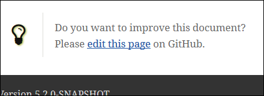
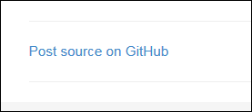
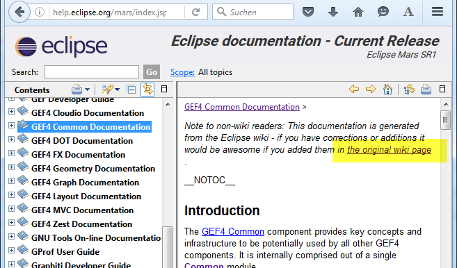

= Documentation: do not forget the edit link
Jeremie Bresson
2016-04-22
:jbake-type: post
:jbake-status: published
:jbake-tags: asciidoctor, open-source
:idprefix:
:listing-caption: Listing

In my opinion if you publish documentation online, you should always tell your readers how they can change/update it.  

I picked up several examples of documentation hosted on GitHub.
On each page there is an "Edit on GitHub" link.
This eases the creation of pull requests.

Example 1: Microsoft Azure documentation (see link:https://azure.microsoft.com/en-us/documentation/articles/java-download-azure-sdk/[this page] for example):

image:2016-04-22_azure.png[]

Example 2: the link:http://www.eclipse.org/xtend/documentation/index.html[Eclipse Xtend documentation]:

Example 3: Eclipse Scout documentation (see link:http://eclipsescout.github.io/6.0/latest/article_helloworld/scout_helloworld/scout_helloworld.html[the scout "hello world" page]):

Example 4: My blog (see link:http://jmini.github.io/blog/2016/2016-03-02_pr_improve_documentation.html[my last article] for example):

And many other projects are following this best practice...

This isn't a GitHub only stuff.
The same pattern can be used if the documentation is hosted on a wiki engine.
As an example the link:http://help.eclipse.org/mars/index.jsp[GEF4 documentation] does it exactly like that:

=== Asciidoctorj macro

If you are using asciidoctor for your documentation and if the sources are hosted on GitHub, you might be interested in the small extension I wrote: link:http://jmini.github.io/asciidoctorj-gh-edit/[asciidoctorj-gh-edit].
Short usage example:

[source,asciidoc]
----
:repository: jmini/jmini.github.io
:branch: develop

Do you want to improve this documentation? Please gh:edit[].
----

A second example where more parameters are defined as arguments of the macro:

[source,asciidoc]
----
See gh:view[repository='asciidoctor/asciidoctor.org', branch='master', path="news/debuter-avec-asciidoctor.adoc", link-text='this article in french'] on GitHub.
----

=== JBake blog

If you have a blog powered by JBake (like this one), you can add the code for the link creation in your templates.
This way JBake generates the desired link on each page. 
I implemented it with some Groovy code included in the template. 
More details can be found on the JBake-user mailing list: link:https://groups.google.com/forum/#!topic/jbake-user/kcFpxlCEHOg[Create a link "see blog post source on GitHub"].

