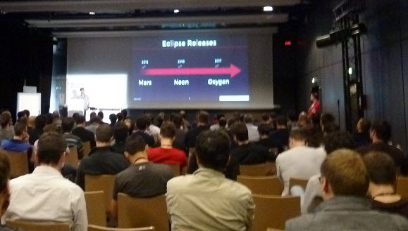
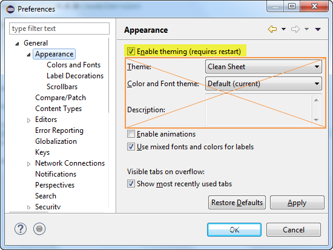

= Eclipse Neon: disable the theming
Jeremie Bresson
2016-04-24
:jbake-type: post
:jbake-status: published
:jbake-tags: eclipse, ide, mars, neon, oxygen, devoxx
:idprefix:
:listing-caption: Listing
:figure-caption: Figure

At link:http://devoxx.fr/[Devoxx France 2016], Mika&#xEB;l Barbero gave link:https://cfp.devoxx.fr/2016/talk/CEK-5422/The_Eclipse_IDE:_The_Force_Awakens[a great talk] about the Eclipse IDE.
The talks was well attended (the room was almost full).
This is the proof that there is still a lot of interest for the Eclipse IDE.

The talk was a great presentation of all improvements made to the IDE (already implemented with mars, coming with neon or oxygen).
It was a big new and noteworthy, organized by main categories that matters to the users and not by eclipse projects.
I really appreciated this approach.

If understand French, I recommend you to watch the video of the talk.
In the other case, I am sure you will learn something by just looking at link:http://www.slideshare.net/mikaelbarbero/the-eclipse-ide-the-force-awakens-devoxx-france-2016[the slides].

Something I have learned:
with Neon you can deactivate the theming (appearance section of the preferences) completely.
In that case the CSS styling engine will be deactivated and your Eclipse IDE will have a really raw look.
To disable the theming, just uncheck the checkbox highlighted in <>

[[img-prefs, Figure 2]]
.Eclipse preferences > General > Appearance (Eclipse Neon)

After a restart your Eclipse will look like this screenshot (<>):

[[img-screenshot, Figure 3]]
.Eclipse IDE with disabled theming
image:2016-04-24_eclipse_neon_disabled_theming.png[]

I hope the performances will be better, it particular when Eclipse IDE is used on distant virtualized environments like Citrix clients.
If you want to test it now, download a link:http://www.eclipse.org/downloads/index-developer.php[Milestone release of Neon].
