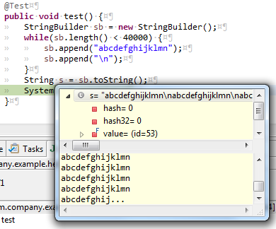

= Eclipse debugging: truncated String values
Jeremie Bresson
2016-05-27
:jbake-type: post
:jbake-status: published
:jbake-tags: eclipse, ide
:idprefix:
:listing-caption: Listing
:figure-caption: Figure

Being able to inspect variable values during debugging is probably one of the mostly used feature in Eclipse.

With String variables, the default Eclipse configuration is to truncate big Strings after 10000 characters.
This can be a problem with long text documents loaded in a String.

.Inspect a big String variable in Eclipse IDE

As always with Eclipse, there is a possibility to change this configuration.
Just open the "Max Length..." entry in the context menu of the detail pane (Variables view).
In the next dialog set the value "Maximum characters to display in details pane". 

.Open the 'Max Length...' entry in the context menu
image:2016-05-27_max_length_menu.png[]

The new limit will also be considered in the yellow overlay window.

