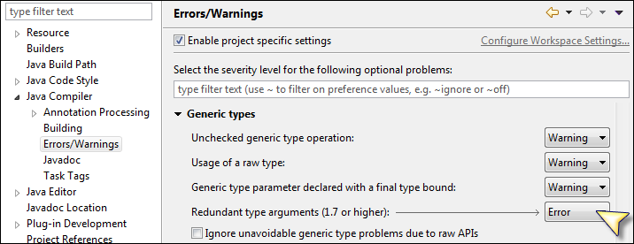
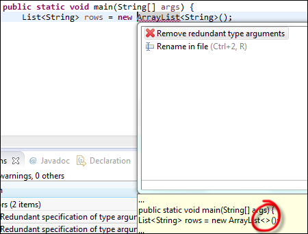
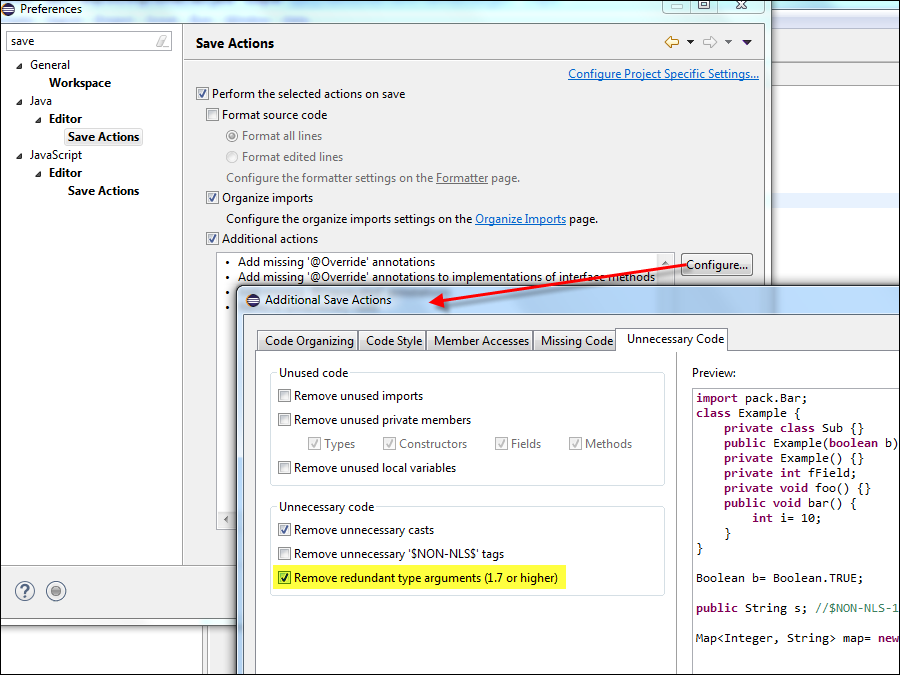

= Eclipse Neon: diamond notation as clean-up action
Jeremie Bresson
2016-06-18
:jbake-type: post
:jbake-status: published
:jbake-tags: eclipse, neon, ide, jdt
:idprefix:
:experimental:
:listing-caption: Listing
:figure-caption: Figure

I know Eclipse Neon brings features in the Java editor that I will use almost every day.
I have already link:https://www.bsi-software.com/en/scout-blog/article/when-reporting-a-bug-helps-to-improve-eclipse.html[blogged] about link:https://bugs.eclipse.org/bugs/show_bug.cgi?id=476304[Bug 476304]. 
It will be a pleasure to be able to navigate to inner classes correctly.

Today I want to write about the link:http://www.eclipse.org/eclipse/news/4.6/jdt.php#remove-redundant-type-arguments[clean-Up to remove redundant type arguments] feature.
This is something I was looking for at the beginning of 2015.

Since Java 7 you can use the Diamond operator. 
The code line presented in <<lst1>> (Java 6) can be written as in <<lst2>> (Java 7).

[[lst1, Listing 1]]
[source, java]
.Declaration and initialization of a List in Java 6
----
List<String> rows = new ArrayList<String>();
----

[[lst2, Listing 2]]
[source, java]
.Usage of the diamond notation in Java 7
----
List<String> rows = new ArrayList<>();
----

With Eclipse Mars (and probably before) you could already let the compiler warn you about Redundant type arguments.
The setting is under Preferences -> Java -> Compiler -> Errors/Warnings in the tree.
And in the list: Generic Types -> Redundant type arguments (1.7 or higher) as presented in <<fig1>>.

[[fig1, Figure 1]]
.Compiler setting for redundant type arguments

With this setting enabled, it was possible to Quick-Fix all the code locations that were not using the diamond operator (see <<fig2>>).

[[fig2, Figure 2]]
.Quick-fix to remove redundant type arguments

This is a lot of kbd:[CTRL, 1] for an operation that does not require any manual intervention. 
If the team as decided to use the diamond notation, it should be used everywhere. 
This belongs to coding guidelines, exactly as code format.

With Eclipse Neon a new clean-up action makes this possible!
You can configure Eclipse to remove redundant type arguments when you save your Java files.
Open the preference page Java -> Editor -> Save actions.
Check the Checkbox "Additional actions" and click on the btn:[Configure...] button.
Switch to the "Unecessary Code" Tab and enable "Remove redundant type arguments (1.7 or higher)"

[[fig3, Figure 3]]
.Configure the new clean-up action with Eclipse Neon

link:http://www.eclipse.org/neon/[Eclipse neon] is coming next wednesday.
Stay tuned!
