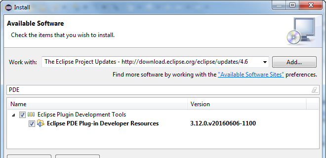
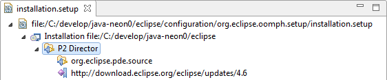
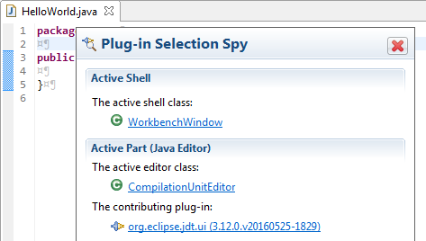

= Install "Plug-in Spy" in your Eclipse Neon IDE
Jeremie Bresson
2016-09-16
:jbake-type: post
:jbake-status: published
:jbake-tags: eclipse, ide, neon
:idprefix:
:listing-caption: Listing
:figure-caption: Figure
:experimental:

There is a lot of documentation about the Eclipse "Plug-in Spy" feature
(link:http://www.vogella.com/tutorials/EclipseCodeAccess/article.html#plug-in-spy-for-ui-parts[Plug-in Spy for UI parts]
or
link:https://scratsh.wordpress.com/2009/06/09/eclipse-3-5-plug-in-spy-and-menus/[Eclipse 3.5 - Plug-in Spy and menus]).
Im my opinion one information is missing: what you need to install to use the Spy feature in your Eclipse Neon IDE.
Here is my small how-to.

Select "Install new Software..." in the "Help" Menu.
In the dialog, switch to the "The Eclipse Project Updates" update site (or enter its location `http://download.eclipse.org/eclipse/updates/4.6`).
Filter with "PDE" and select the "Eclipse PDE Plug-in Developer Resources".
Validate your choices with "Next" and "Finish", Eclipse will install the feature and ask for a Restart.

[[img-dialog, Figure 1]]
.Install new Software in Eclipse

If you prefer the Oomph way, you can paste the snippet contained in <<lst-oomph>> in your `installation.setup` file (Open it with the Menu: menu:Navigate[Open Setup,Installation]).

[[lst-oomph, Listing 1]]
[source,xml]
----
<?xml version="1.0" encoding="UTF-8"?>
<setup.p2:P2Task
    xmi:version="2.0"
    xmlns:xmi="http://www.omg.org/XMI"
    xmlns:setup.p2="http://www.eclipse.org/oomph/setup/p2/1.0">
  <requirement
      name="org.eclipse.pde.source.feature.group"/>
  <repository
      url="http://download.eclipse.org/eclipse/updates/4.6"/>
</setup.p2:P2Task>
----

Your Oomph Editor should looks like in <>.
Save the file and select "Perform Setup Task..." (in the menu:Help[] menu).
Oomph will update your installation and will ask for a restart.

[[img-oomph, Figure 2]]
.Oomph setup Editor: installation.setup File

In both cases, after the restart you can press kbd:[alt,shift,f1] and use the Plug-in Spy as in <>.

[[img-spy, Figure 3]]
.Plug-in Spy in Eclipse Neon

