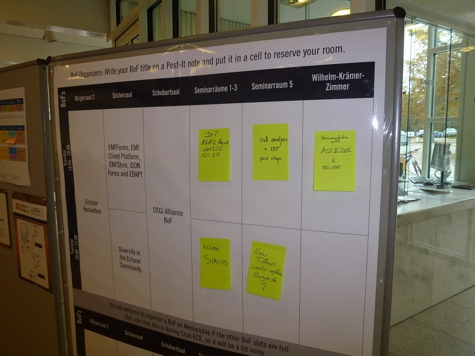

= Asciidoctor instead of MediaWiki? 
Jeremie Bresson
2016-10-28
:jbake-type: post
:jbake-status: published
:jbake-tags: eclipse, asciidoctor
:idprefix:
:listing-caption: Listing
:figure-caption: Figure
:experimental:

During link:https://www.eclipsecon.org/europe2016/[EclipseCon Europe 2016] we had a great BoF Session about documentation with Asciidoctor at Eclipse.
A lot of subjects were discussed, from the editing possibilities inside or outside Eclipse IDE to the best toolchains for document generation/customization.

One topic that was discussed during the meeting was the conversion of MediaWiki documentation to the AsciiDoc format.
I am happy to blog about this topic and to propose a solution.

A lot of Eclipse projects are using the link:https://wiki.eclipse.org/[Eclipse MediaWiki instance] for their documentation.
Maybe I can summarize my vision on this topic:
I consider the usage of a Git repository better as a wiki engine.
A wiki engine is not enough when it comes to documentation of different versions of your project/product (git branches, cherry pick...).
If you host the repository on GitHub (it works also with GitLab) and if you use one of the markup syntaxes supported by the online editor, you get almost the same experience as with a wiki engine (online edition, online preview of changes, navigation in the history, diffs...).
Reviews and discussions inside pull requests are a great way to collaborate.
Having also everything offline is a big plus (I work a lot in the train).
Amongst the different markup syntaxes you can choose, I consider the AsciiDoc format as the best option (management of code snippets, callout support in listings blocs, variable substitution and conditional inclusion, multiple output formats, live preview in browser during edition in any text editor, easy integration in existing build toolchain, possibility to extend the language with custom macros...).
In my opinion Asciidoctor is becoming a state of the art documentation toolchain in many projects.

This immediately raises the next question:
what can we do with the great content we have on the Eclipse wiki?
How can it be migrated to the AsciiDoc format?
In my opinion the link:https://eclipse.org/mylyn/docs[Mylyn Wikitext project] can help, but an `AsciiDocDocumentBuilder` is missing.
I have opened link:https://bugs.eclipse.org/bugs/show_bug.cgi?id=506643[Bug 506643] for that and link:https://git.eclipse.org/r/84040[contributed] a first implementation.
My code will now go through the eclipse review process.
To test it today, you need to check out the repo (and the corresponding gerrit change).

Here a simple example:

[listing,mediawiki]
.Example MediaWiki document
----
'''Lorem ipsum''' sed tempor euismod elit, et eleifend tellus lacinia a.

=== Penatibus et magnis

Pellentesque ut ''lorem lorem''.

[[Image:foo.png|Foo image]]

Nulla ut sapien tellus. Quisque id semper nulla. Nullam facilisis risus turpis.

* Cras posuere tempor urna
* Laoreet pharetra diam rhoncus at
* Quisque ornare diam eu iaculis auctor.

Pellentesque tincidunt ultricies varius. [http://eclipse.org/ Lorem ipsum dolor] sit amet, consectetur adipiscing elit.

Cum sociis natoque penatibus et magnis dis parturient montes, nascetur ridiculus mus. Suspendisse potenti.
----

That will be converted to:

[listing,asciidoc]
.Result of the conversion to AsciiDoc
----
*Lorem ipsum* sed tempor euismod elit, et eleifend tellus lacinia a.

=== Penatibus et magnis

Pellentesque ut _lorem lorem_.

image:foo.png[title="Foo image"]

Nulla ut sapien tellus. Quisque id semper nulla. Nullam facilisis risus turpis.

* Cras posuere tempor urna
* Laoreet pharetra diam rhoncus at
* Quisque ornare diam eu iaculis auctor.

Pellentesque tincidunt ultricies varius. link:http://eclipse.org/[Lorem ipsum dolor] sit amet, consectetur adipiscing elit.

Cum sociis natoque penatibus et magnis dis parturient montes, nascetur ridiculus mus. Suspendisse potenti.
----

Of course my tool has certainly some limitations.
Markup conversion is never an easy task.
I think that the MediaWiki parser provided by the Mylyn Wikitext project is a good choice, because it is already used for the generation of some eclipse help pages.
For the conversion to AsciiDoc there is already some support in the Wikitext framework (AsciiDoc is just an other output Markup there).
I just created a new class: `AsciiDocDocumentBuilder` (plus an other one for the test suite).
I have used the `MarkdownDocumentBuilder` as base and adapted it for AsciiDoc.
I consider my implementation as a first usable version.
Any feedback is welcomed (on the Bug, on Gerrit, twitter or on the mailing list).
Depending on the feedback, I will be happy to iterate and to improve it for concrete use cases.

By the way, if an Eclipse Project wants to migrate and start to use Asciidoctor, I will be happy to help as much as I can.

EDIT: the feature is available in Eclipse IDE Oxygen version, read more here: <<2016-12-21_convert_to_asciidoc.adoc#, Oxygen M4: convert to AsciiDoc with Mylyn WikiText>>.