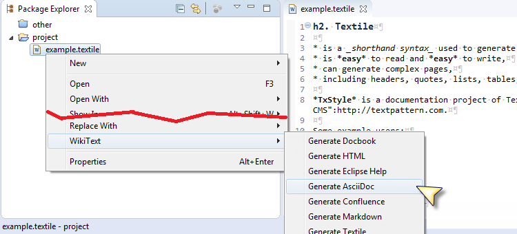
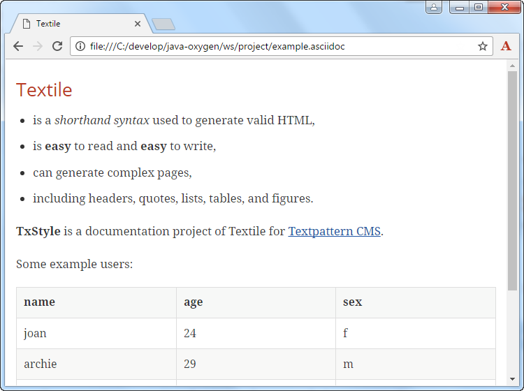

= Oxygen M4: convert to AsciiDoc with Mylyn WikiText
Jeremie Bresson
2016-12-21
:jbake-type: post
:jbake-status: published
:jbake-tags: eclipse, asciidoctor
:idprefix:
:listing-caption: Listing
:figure-caption: Figure
:experimental:

If you need to convert your documentation to the AsciiDoc format, you might be interested in this new feature delivered with Eclipse Oxygen M4 (see also my previous blog post: <<2016-10-28_from_mediawiki_to_asciidoc.adoc#, Asciidoctor instead of MediaWiki?>>).
Any file format supported by Mylyn WikiText (textile, mediawiki, markdown and more) can now be converted to the AsciiDoc format.
Just select menu:WikiText[Generate AsciiDoc] from the context menu in the package explorer.

A new file is generated near to the original file (`example.asciidoc` in this example).
Of course you can preview it with your favorite asciidoctor viewer (Chrome with the link:https://chrome.google.com/webstore/detail/asciidoctorjs-live-previe/iaalpfgpbocpdfblpnhhgllgbdbchmia?hl=en[Asciidoctor.js Live Preview] extension in my case).

While I was trying to convert some pages of link:http://wiki.eclipse.org/[Eclipsepedia] to Asciidoctor, I have noticed that some additional concepts need to be supported by the converter.
I have opened link:https://bugs.eclipse.org/bugs/show_bug.cgi?id=508262[Bug 508262] to track them.
Feel free to leave feedback there if something is not working for you.

You can get the Oxygen M4 version of Eclipse IDE from the link:http://www.eclipse.org/downloads/index-developer.php[Developer Builds download page].
