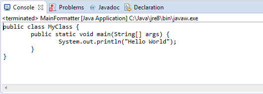

= Use the Eclipse Java Development Tools in a Java SE application
Jeremie Bresson
2017-01-10
:jbake-type: post
:jbake-status: published
:jbake-tags: eclipse, jdt, maven
:idprefix:
:listing-caption: Listing
:figure-caption: Figure
:experimental:

Stephan Herrmann has link:https://objectteams.wordpress.com/2017/01/09/eclipse-neon-2-is-on-maven-central/[announced] that some libraries of the Eclipse Neon.2 release are now available on link:https://search.maven.org/[maven central]. 

It is now easy to reuse the piece of Eclipse outside any Eclipse based application.
Let me share with you this simple example: _use the java code formatter of Eclipse JDT in a simple java main class_.

*Step 1*: create a very simple maven project. You will need link:https://search.maven.org/#artifactdetails%7Corg.eclipse.jdt%7Corg.eclipse.jdt.core%7C3.12.2%7Cjar[org.eclipse.jdt.core] as dependency.

[source, xml]
.Example pom.xml
----
<project xmlns="http://maven.apache.org/POM/4.0.0" 
      xmlns:xsi="http://www.w3.org/2001/XMLSchema-instance" 
      xsi:schemaLocation="http://maven.apache.org/POM/4.0.0 http://maven.apache.org/xsd/maven-4.0.0.xsd">
  <modelVersion>4.0.0</modelVersion>
  <groupId>example</groupId>
  <artifactId>java-formatter</artifactId>
  <version>1.0.0-SNAPSHOT</version>

  <dependencies>
    <dependency>
      <groupId>org.eclipse.jdt</groupId>
      <artifactId>org.eclipse.jdt.core</artifactId>
      <version>3.12.2</version>
    </dependency>
  </dependencies>
</project>
----

*Step 2*: write a java class with a main method.

[source, java]
.Example main class
----
import java.util.Properties;

import org.eclipse.jdt.core.JavaCore;
import org.eclipse.jdt.core.ToolFactory;
import org.eclipse.jdt.core.formatter.CodeFormatter;
import org.eclipse.jdt.internal.compiler.impl.CompilerOptions;
import org.eclipse.jface.text.BadLocationException;
import org.eclipse.jface.text.Document;
import org.eclipse.jface.text.IDocument;
import org.eclipse.text.edits.TextEdit;

public class MainFormatter {

  public static void main(String[] args) {
    String result;

    String javaCode = "public class MyClass{ " 
                        + "public static void main(String[] args) { " 
                        + "System.out.println(\"Hello World\");" 
                        + " }" 
                        + " }";

    Properties prefs = new Properties();
    prefs.setProperty(JavaCore.COMPILER_SOURCE, CompilerOptions.VERSION_1_8);
    prefs.setProperty(JavaCore.COMPILER_COMPLIANCE, CompilerOptions.VERSION_1_8);
    prefs.setProperty(JavaCore.COMPILER_CODEGEN_TARGET_PLATFORM, CompilerOptions.VERSION_1_8);

    CodeFormatter codeFormatter = ToolFactory.createCodeFormatter(prefs);
    IDocument doc = new Document(javaCode);
    try {
      TextEdit edit = codeFormatter.format(CodeFormatter.K_COMPILATION_UNIT | CodeFormatter.F_INCLUDE_COMMENTS, 
                                             javaCode, 0, javaCode.length(), 0, null);
      if (edit != null) {
        edit.apply(doc);
        result = doc.get();
      }
      else {
        result = javaCode;
      }
    }
    catch (BadLocationException e) {
      throw new RuntimeException(e);
    }

    System.out.println(result);
  }
}
----

*Step 3*: there is no step 3!
You can just run your code in your IDE or from the command line using maven to compute your classpath.

The code used in this example is a simplification of what you can find in another great open-source project: link:https://github.com/forge/roaster[JBoss Forge Roaster].

