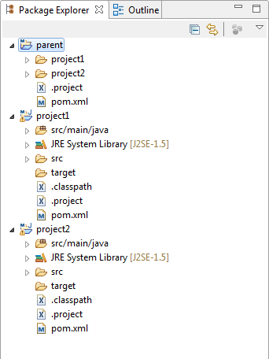
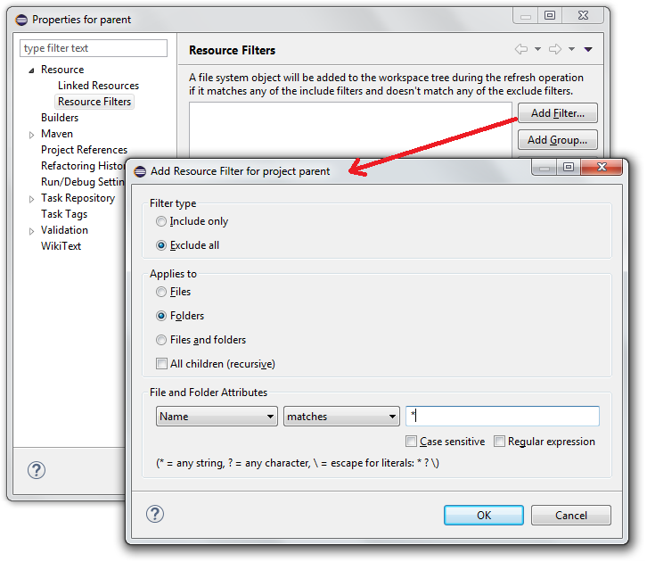
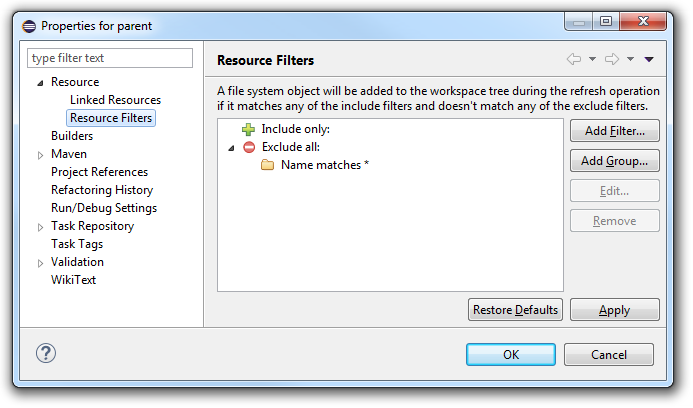
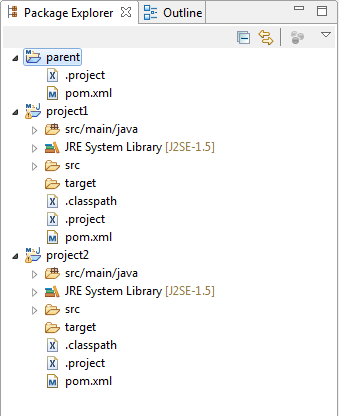
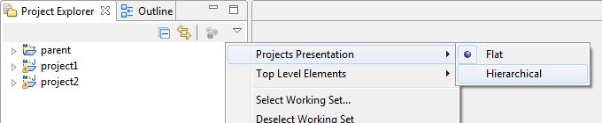
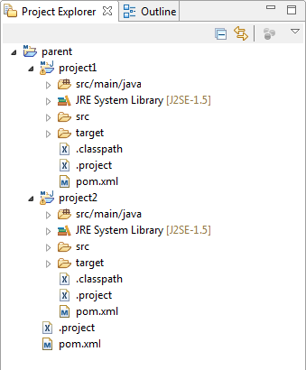

= Ressource filter at project level in Eclipse IDE
Jeremie Bresson
2017-01-27
:jbake-type: post
:jbake-status: published
:jbake-tags: eclipse, maven
:idprefix:
:listing-caption: Listing
:figure-caption: Figure
:experimental:

If you follow the maven convention in multi-modules maven project, your directory structure will looks like this:

----
\---parent
    |   .project
    |   pom.xml
    |
    +---project1
    |   |   .classpath
    |   |   .project
    |   |   pom.xml
    |   |
    |   \---src/main/java
    |       \---...
    |
    \---project2
        |   .classpath
        |   .project
        |   pom.xml
        |
        \---src/main/java
            \---...
----

When the projects are imported in Eclipse IDE, the parent project looks not nice in the _Package Explorer_.
The child modules `project1` and `project2` appear twice: as sub-folder of the `parent` project and as separated java project.
In my opinion this is not really user-friendly.

A solution was suggested by Ed Merks: in the parent project, the child folders can be filtered.
Use the _Ressource Filters_ at project level.
Select the menu:Properties[] context menu on the parent project and select "Ressource Filters" under "Ressource" in the tree.
Click on the btn:[Add Filter...] button.
In the Dialog configure your filter to exclude all folders with a name that matches `*`.

The configuration should look like this:

If you have a look at the xml content in the `.project` file of the `parent` project, you should see something like this:

[source, xml]
----
	<filteredResources>
		<filter>
			<id>1485436062166</id>
			<name></name>
			<type>10</type>
			<matcher>
				<id>org.eclipse.ui.ide.multiFilter</id>
				<arguments>1.0-name-matches-false-false-*</arguments>
			</matcher>
		</filter>
	</filteredResources>
----

With this new project configuration, the _Package Explorer_ now hides its child folders. 
This means that you no longer see the modules `project1` and `project2` in the `parent` project:

I hope this will helps projects that have similar needs.

---

There is also an easier way to display this standard maven structure in Eclipse IDE: use the _Project Explorer_ instead of the _Package Explorer_.

With the menu item menu:Projects Presentation[Hierarchical] the display behavior in the _Project Explorer_ can be modified.

With this new configuration, the maven structure is reflected in the IDE:

This works even with the resource filter configuration approach presented in this blog post.

