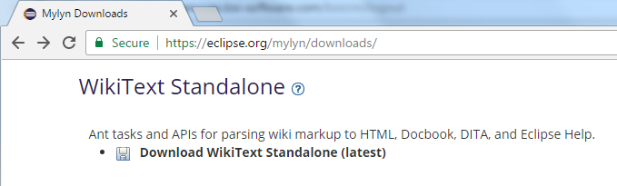

= Mylyn Docs Wikitext: changes with Version 3.0.0
Jeremie Bresson
2017-02-02
:jbake-type: post
:jbake-status: published
:jbake-tags: eclipse, wikitext
:idprefix:
:listing-caption: Listing
:figure-caption: Figure
:experimental:

David Green has proposed to do a lot of changes to Mylyn Docs Wikitext.
The "core" plugins will now be plain java/maven artifacts.
The expected benefits are:

* easier to build/release Mylyn Docs (or at least Mylyn WikiText) separately from Mylyn
* easier to consume Mylyn WikiText core bundles (e.g. as plain jars, with normal poms)
* easier to contribute (e.g. without knowledge of OSGi or PDE)
* better structured code/tests (e.g. using normal Maven project layout)
* faster cycle time (e.g. easier to verify code changes, faster builds)

Another side goal is to be present on maven central as soon as possible.

These structural modifications require changing the version to `3.0.0-SNAPSHOT` and this is the occasion to review what we are publishing and how (update sites, features, p2 repository, bundle names, package names, ...).
If you are using wikitext as part of your build (to build the eclipse help for example) or as part of another tool, be aware that this is a breaking change.
Your feedback is welcomed on link:https://bugs.eclipse.org/bugs/show_bug.cgi?id=511120[Bug 511120].
You can also follow the discussion on the link:http://dev.eclipse.org/mhonarc/lists/mylyn-docs-dev/[mylyn-docs-dev mailing list].

Here is one example: 
we might drop the standalone distribution of wikitext (jars available in a zip) that is currently available on the link:https://eclipse.org/mylyn/downloads/[Mylyn download page].

If you are using it, please notify us on Bugzilla.
