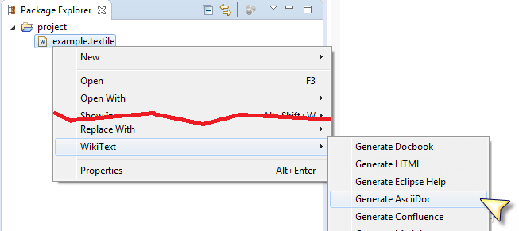
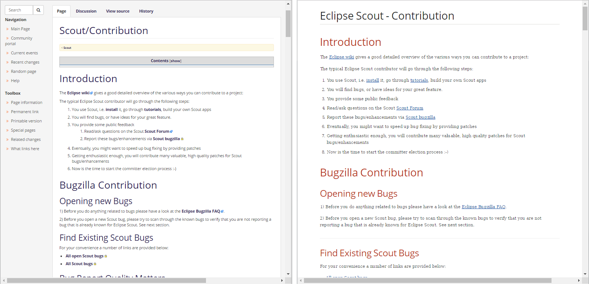

= Mylyn Wikitext is available on maven central
Jeremie Bresson
2017-03-26
:jbake-type: post
:jbake-status: published
:jbake-tags: eclipse, wikitext, asciidoc
:idprefix:
:listing-caption: Listing
:figure-caption: Figure
:experimental:

As announced in my <<2017-02-02_wikitext_v3.adoc#, previous blog post>>, important refactorings are going in the mylyn wikitext project.
One of the first goals is achieved:
the jars are now available on maven central (see also link:http://greensopinion.com/2017/03/06/Mylyn-WikiText-on-Maven-Central.html[Mylyn WikiText on Maven Central] by David Green).
Have a look at the link:https://mvnrepository.com/artifact/org.eclipse.mylyn.docs[org.eclipse.mylyn.docs group] in a maven central viewer (right now the newest version is `3.0.6`).

Wikitext provides the capability to transform from one language to another. 
I have already blogged about the <<tmp/../../2016/2016-12-21_convert_to_asciidoc.adoc#, possibility to convert to AsciiDoc>> from Eclipse IDE
(new feature introduced with Oxygen M4).

Let demonstrates how you can convert from MediaWiki to AsciiDoc, directly in a small Java program.
It is just a few lines of code in a simple main class.

In the Example the content of the link:http://wiki.eclipse.org/Scout/Contribution[Scout/Contribution page] taken from the Eclipse wiki will be converted into an AsciiDoc File: `scout_contribution.adoc`.
The code is straight forward:

[source, java]
.Example main class
----
import java.io.File;
import java.io.StringWriter;
import java.net.URL;

import org.eclipse.mylyn.wikitext.asciidoc.internal.AsciiDocDocumentBuilder;
import org.eclipse.mylyn.wikitext.mediawiki.MediaWikiLanguage;
import org.eclipse.mylyn.wikitext.parser.DocumentBuilder;
import org.eclipse.mylyn.wikitext.parser.MarkupParser;

import com.google.common.base.Charsets;
import com.google.common.io.Files;
import com.google.common.io.Resources;

public class MediaWikiToAdocExample {

  public static void main(String[] args) throws Exception {
    String url = "http://wiki.eclipse.org/index.php?title=Scout/Contribution&action=raw&templates=expand";
    String input = Resources.toString(new URL(url), Charsets.UTF_8);

    MediaWikiLanguage markupLanguage = new MediaWikiLanguage();
    markupLanguage.setInternalLinkPattern("https://wiki.eclipse.org/index.php?title={0}");
    MarkupParser parser = new MarkupParser(markupLanguage);
    
    StringWriter writer = new StringWriter();
    DocumentBuilder builder = new AsciiDocDocumentBuilder(writer);
    parser.setBuilder(builder);
    parser.parse(input);
    
    String output = "= Eclipse Scout - Contribution\n\n";
    output += writer.toString();
    Files.write(output, new File("scout_contribution.adoc"), Charsets.UTF_8);
  }
}
----

On your classpath, you will need some of the wikitext jars and google guava.
The `pom.xml` File for Maven looks like this:

[source, xml]
.pom.xml for the Example
----
<?xml version="1.0" encoding="UTF-8"?>
<project xmlns="http://maven.apache.org/POM/4.0.0" xmlns:xsi="http://www.w3.org/2001/XMLSchema-instance" xsi:schemaLocation="http://maven.apache.org/POM/4.0.0 http://maven.apache.org/xsd/maven-4.0.0.xsd">
    <modelVersion>4.0.0</modelVersion>

    <groupId>wikitext.examples</groupId>
    <artifactId>mediawiki-to-adoc</artifactId>
    <version>0.0.1-SNAPSHOT</version>

    <dependencies>
        <dependency>
            <groupId>org.eclipse.mylyn.docs</groupId>
            <artifactId>org.eclipse.mylyn.wikitext</artifactId>
            <version>3.0.6</version>
        </dependency>
        <dependency>
            <groupId>org.eclipse.mylyn.docs</groupId>
            <artifactId>org.eclipse.mylyn.wikitext.mediawiki</artifactId>
            <version>3.0.6</version>
        </dependency>
        <dependency>
            <groupId>org.eclipse.mylyn.docs</groupId>
            <artifactId>org.eclipse.mylyn.wikitext.asciidoc</artifactId>
            <version>3.0.6</version>
        </dependency>
        <dependency>
            <groupId>com.google.guava</groupId>
            <artifactId>guava</artifactId>
            <version>21.0</version>
        </dependency>
    </dependencies>

    <build>
        <plugins>
            <plugin>
                <groupId>org.apache.maven.plugins</groupId>
                <artifactId>maven-compiler-plugin</artifactId>
                <version>3.6.0</version>
                <configuration>
                    <source>1.8</source>
                    <target>1.8</target>
                </configuration>
            </plugin>
        </plugins>
    </build>
</project>
----

Here is a side by side comparison of the wiki page and of a preview of `scout_contribution.adoc`:

If you look very closely at this example, you might notice some issues during the conversion process.
I have reported them in link:https://bugs.eclipse.org/bugs/show_bug.cgi?id=508262[Bug 508262].

If you are interessted by the Mylyn Wikitext project, you can follow link:https://twitter.com/WikiText[@WikiText] on twitter.
You can ask questions on StackOverflow using the link:http://stackoverflow.com/questions/tagged/mylyn-wikitext[mylyn-wikitext] tag.
Are you looking for more usage examples of Mylyn Wikitext?
Have a look at link:https://github.com/greensopinion/wikitext-examples[greensopinion/wikitext-examples] on GitHub. 
David Green has prepared additional use cases there.

