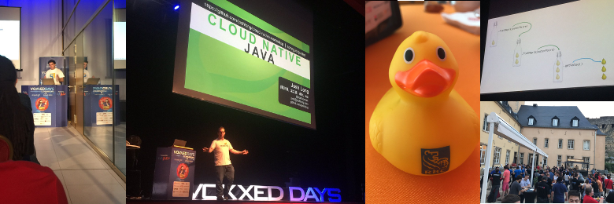
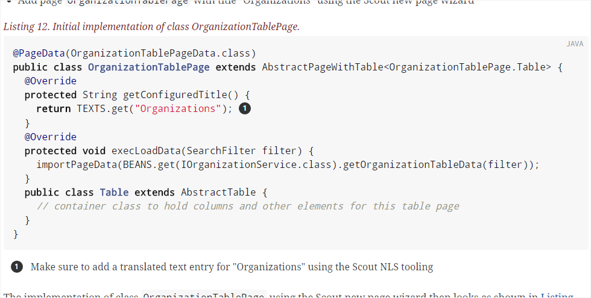
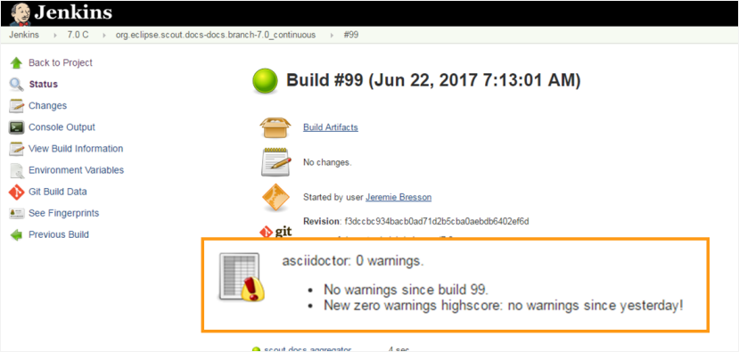
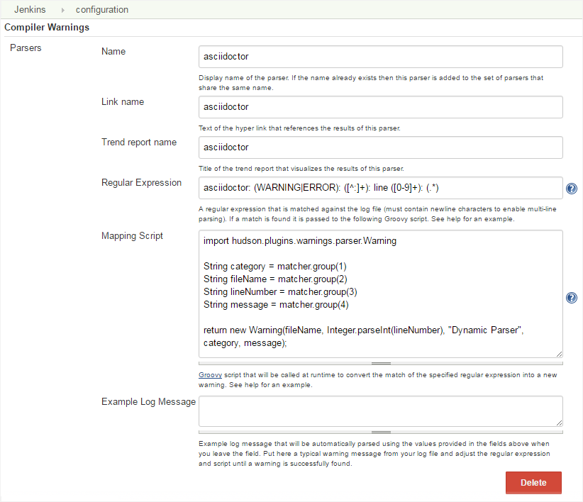
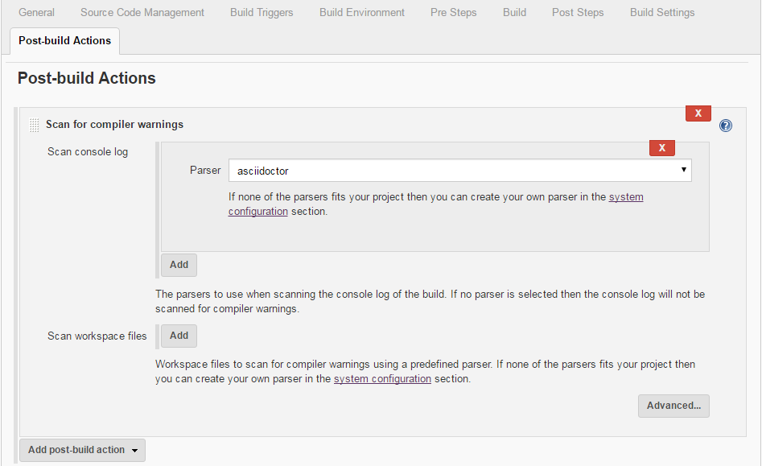

= Asciidoctor: watch you build log
Jeremie Bresson
2017-06-25
:jbake-type: post
:jbake-status: published
:jbake-tags: asciidoc, asciidoctor, jenkins, maven
:idprefix:
:listing-caption: Listing
:figure-caption: Figure
:experimental:

Last thursday at Voxxed Days Luxembourg I had the opportunity to speak about asciidoctor in my talk (link:http://cfp-voxxed-lux.yajug.org/2017/talk/KMC-5325/Documentation_as_code:_controler_la_qualite_![Documentation as code: contr&#244;ler la qualit&#233; !] - link:https://www.slideshare.net/jmini/20170622-documentation-as-code[slides] - link:https://www.youtube.com/watch?v=Z5nmB7lrsqU[video]).
Voxxed Days conferences are similar to Devoxx, but smaller (only one day).
It was the second edition of Voxxed Days Luxembourg and the conference is really great (perfect organization, pleasant ambience, nice people and interesting conversations).

Back to my talk, I want to provide more details about a point I have presented: *how to monitor your asciidoctor build logs with jenkins*.

During the build, asciidoctor tells you when something is unexpected.
Let me give you a real example:
In the link:http://eclipsescout.github.io/[eclipse scout documentation], you have a lot of code snippets with callouts to mark certain lines.

[[fig-doc, Figure 1]]
.Eclipse scout documentation extract

In order to do this, you need to define the callout in your source code and add the explanation after the code snippet as presented in <<lst-callout>>.

[[lst-callout, Listing 1]]
[source,asciidoc,subs=specialcharacters]
.Callout example
....
[source,adoc]
.Initial implementation of class OrganizationTablePage.
----
(..)
    return TEXTS.get("Organizations"); // <1>
(..)
----
<1> Make sure to add a translated text entry for "Organizations" using the Scout NLS tooling
....

If there is a mismatch between the two elements, you will get a warning in your logs:

----
[INFO] 
[INFO] --- asciidoctor-maven-plugin:1.5.5:process-asciidoc (book_scout_intro-to-html) @ scout_beginners_guide ---
[INFO] Using 'UTF-8' encoding to copy filtered resources.
[INFO] ignoreDelta true
[INFO] Copying 0 resource
asciidoctor: WARNING: _TutorialStep2.adoc: line 247: no callouts refer to list item 1 beginners_guide/src/docs/beginners-guide.adoc
[INFO] 
----

If you are using Jenkins as continuous integration server, the link:https://plugins.jenkins.io/warnings[warnings plugin] helps you to find those lines in your log.
It also keeps a record of them, in order to track the evolution over the time.

Here is how you can configure the plugin in the admin view in order to detect the asciidoctor lines:

.Regular expression:
----
asciidoctor: (WARNING|ERROR): ([^:]+): line ([0-9]+): (.*)
----

.Mapping Script:
----
import hudson.plugins.warnings.parser.Warning

String category = matcher.group(1)
String fileName = matcher.group(2)
String lineNumber = matcher.group(3)
String message = matcher.group(4)

return new Warning(fileName, Integer.parseInt(lineNumber), "Dynamic Parser", category, message);
----

Then in your build definition you need to add a post-build step:

Now you are informed when something goes wrong in your documentation.
By the way there is the idea that Asciidoctor could produce a report containing all the warnings and errors that are discovered during the build.
They could be collected in a xml or json file.
For the moment link:https://github.com/asciidoctor/asciidoctor/issues/44[issue #44] is still open.

You can have a look at the slides on link:https://www.slideshare.net/jmini/20170622-documentation-as-code[SlideShare] or at the recorded video on link:https://www.youtube.com/watch?v=Z5nmB7lrsqU[YouTube] (in french).

PS: I have already proposed link:https://www.eclipsecon.org/europe2017/session/documentation-code-asciidoctor[a talk] for EclipseCon Europe 2017.
I hope I will get a slot to be able to present more aspects of the "documentation as code" pattern.
