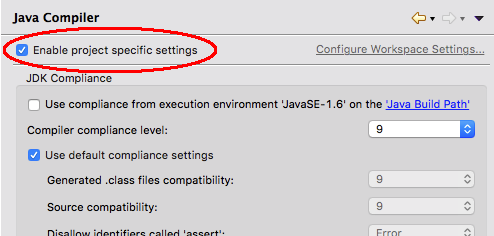
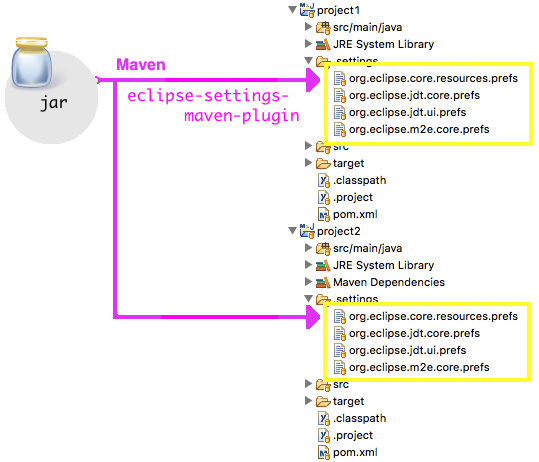

= Use the eclipse-settings-maven-plugin to synchronize prefs files across projects
Jeremie Bresson
2018-02-05
:jbake-type: post
:jbake-status: published
:jbake-tags: eclipse, prefs, maven
:idprefix:
:listing-caption: Listing
:figure-caption: Figure
:experimental:

The question « _Should the meta files related to an IDE be committed in the git repository?_ » is a never-ending fight. According to link:https://twitter.com/apupier[Aurelien Pupier], the answer to this question is YES (link:https://www.eclipsecon.org/europe2015/comment/628.html[Talk] from 2015 - link:https://www.slideshare.net/AurelienPupier/committing-ide-meta-files-misconceptions-misunderstandings-and-solutions[slides] and link:https://www.youtube.com/watch?v=J5RzSbpNLM4[video]). I totally agree with him, because settings files like `org.eclipse.core.resources.prefs`, `org.eclipse.jdt.core.prefs`, `org.eclipse.jdt.ui.prefs` or `org.eclipse.m2e.core.prefs` can contain valuable configuration information that will be shared between all Eclipse IDE users working on the project: code formatting rules, save actions, automated code cleanup tasks, compiler settings…

Even today a lot of people still prefer not to have the IDE metadata files in their git Repository. This means that every coworker needs to configure his IDE and more important everybody needs to keep the configuration in sync with the team over the time.

In both cases (having the settings files in your repo or not), the link:https://github.com/BSI-Business-Systems-Integration-AG/eclipse-settings-maven-plugin[eclipse-settings-maven-plugin] can be interesting for you. The idea is to use maven in order to replicate the same prefs files across multiple maven modules. This way you can distribute the prefs file if they are missing in the git repository. An other use case is the distribution accros multiple teams (for example at organization level).

The source for the settings file is a simple maven artifact located in a maven repository. With a single maven command, you can synchronize the prefs files.

If you wants to see how the setup looks like, you can refer to my link:https://jmini.github.io/sync-eclipse-settings-example/[sync-eclipse-settings-example] page and the associated GitHub project. I have updated it in order to use the latest version published last week by my former colleagues at BSI Business Systems Integration AG.
