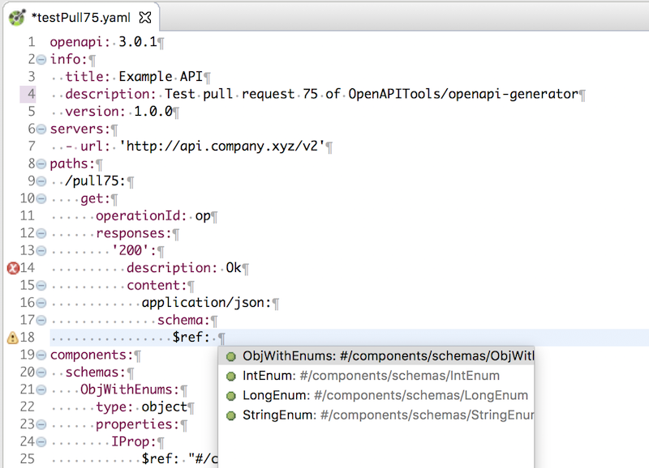

= Edit an OpenAPI specification in Eclipse IDE
Jeremie Bresson
2018-06-08
:jbake-type: post
:jbake-status: published
:jbake-tags: open-source, openapi, eclipse
:idprefix:
:listing-caption: Listing
:figure-caption: Image
:experimental:

I am working a lot on the link:https://github.com/OpenAPITools/openapi-generator[OpenAPI Generator] project these days.
This means that I need to edit OpenAPI Specification files a lot.
A specification file is a `*.yaml` file that describes a REST API.

In Eclipse IDE I have installed the link:https://github.com/RepreZen/KaiZen-OpenApi-Editor[KaiZen OpenAPI Editor] plugin.
This is an Xtext editor that provides everything that you need to be efficient with your OpenAPI specification: outline, code completion, jumps for references, renaming support...

It can be installed from the link:https://marketplace.eclipse.org/content/kaizen-openapi-editor[Eclipse Marketplace].

If you use the Eclipse Installer (also called Oomph), you can add this xml snippet to your `installation.setup` file:

[source,xml]
.Oomph snippet to install the KaiZen OpenAPI Editor
----
<?xml version="1.0" encoding="UTF-8"?>
<setup.p2:P2Task
    xmi:version="2.0"
    xmlns:xmi="http://www.omg.org/XMI"
    xmlns:setup.p2="http://www.eclipse.org/oomph/setup/p2/1.0">
  <requirement
      name="com.reprezen.swagedit.feature.feature.group"/>
  <repository
      url="http://products.reprezen.com/swagedit/latest/"/>
</setup.p2:P2Task>
----

It is free and open-source (EPL). Enjoy.