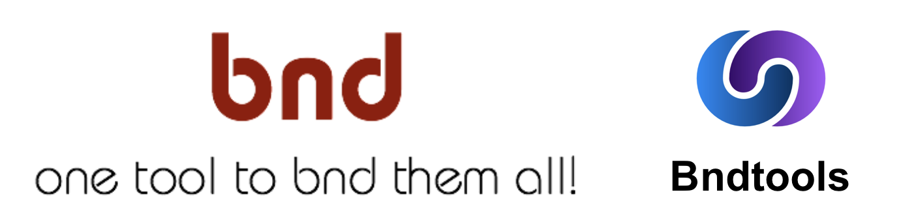

= Building and running Equinox with maven without Tycho
Jeremie Bresson
2020-01-13
:jbake-type: post
:jbake-status: published
:jbake-tags: eclipse, equinox, bnd, maven
:idprefix:
:listing-caption: Listing
:figure-caption: Figure
:experimental:

Eclipse Tycho is a great way to let maven build PDE based projects.
But the Plug-in Development Environment (PDE) model is not the only way to work with OSGi.

In particular, since 2 or 3 years the Eclipse Platform jars (including the Equinox jars) are regularly published on Maven Central (check the artifacts having `org.eclipse.platform` as `groupId`).

I was looking for an alternative to P2 and to the target-platform mechanism.

Bnd and Bndtools are always mentioned as potential alternative to PDE (I attended several talks discussing this at EclipseCon 2018: link:https://www.eclipsecon.org/europe2018/sessions/migrating-pde-bndtools-practice[Migrating from PDE to Bndtools in Practice], link:https://www.eclipsecon.org/europe2018/sessions/zero-professional-osgi-project-minutes[From Zero to a Professional OSGi Project in Minutes]).
So I decided to explore this path.

This StackOverflow question catches my attention: link:https://stackoverflow.com/questions/52776222/how-to-start-with-osgi[How to start with OSGi].
I had a close look at the answer provided by Peter Kriens (the founder of the Bnd and Bndtools projects), where he discusses the different possible setup:

* Maven Only
* Gradle Only
* Eclipse, M2E, Maven, and Bndtools
* Eclipse, Bndtools, Gradle

Even in the "Maven Only" or "Gradle Only" setups, the proposed solution relies on plugins using bnd under the hood.

My project is quite simple, the dependencies are already on maven central.
I will not have a complex use-case with multiple versions of the same library or with platform dependent artifacts.
So fetching the dependencies with maven is sufficient.

I decided to try the "Maven Only" model.

I was not sure to understand how to use the different maven bnd plugins: `bnd-maven-plugin`, `bnd-indexer-maven-plugin`, `bnd-testing-maven-plugin`, `bnd-export-maven-plugin` …

Luckily I found the slides of the link:https://www.slideshare.net/mfrancis/bndtools-and-maven-a-brave-new-world-n-bartlett-t-ward[Bndtools and Maven: A Brave New World] workshop (given at EclipseCon 2017) and the corresponding git repository: link:https://github.com/paremus/osgi-community-event2017[osgi-community-event2017].

The corresponding link:https://github.com/effectiveosgi/maven-archetypes[effective-osgi maven archetypes] used during the workshop are still working well.
I could follow the step-by-step guide (in the readme of the maven archetypes project).
I got everything working as described and I could find enough explanations about the generated projects.
I think I understood what I did and this is very important when you start.

After some cleanup and a switch from Apache Felix to Eclipse Equinox, I got my running setup and I answered my question: "_How to start with OSGi without PDE and Tycho_".

The corresponding code is in this folder: link:https://github.com/jmini/bnd-experiments/tree/master/effectiveosgi-example[effectiveosgi-example].
